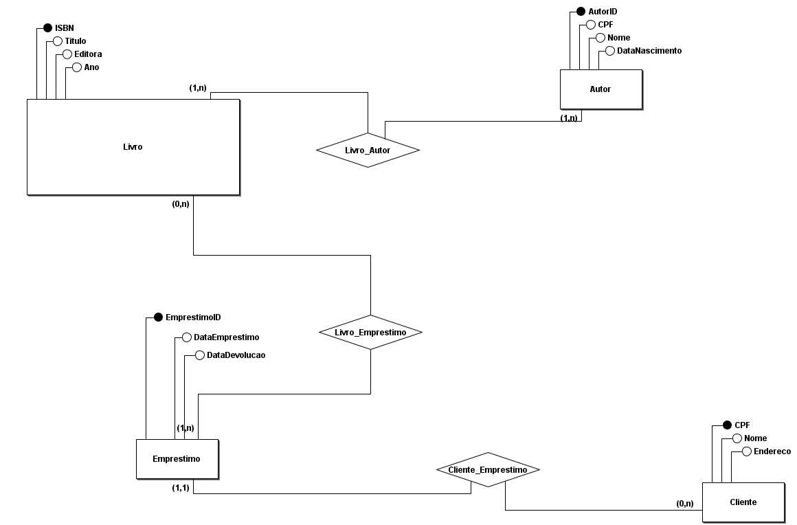
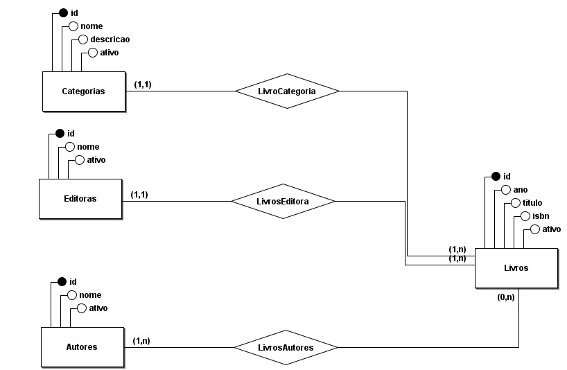
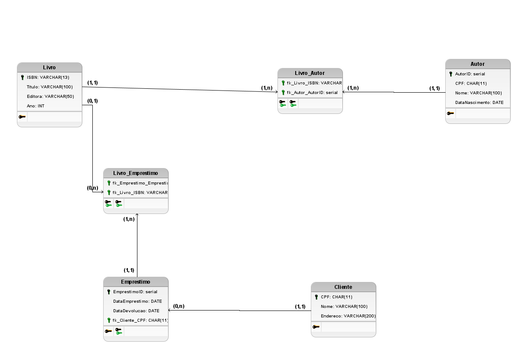
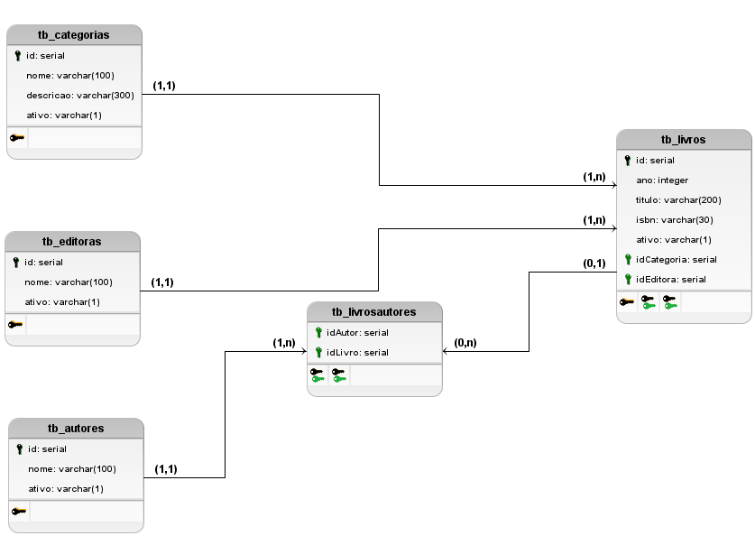
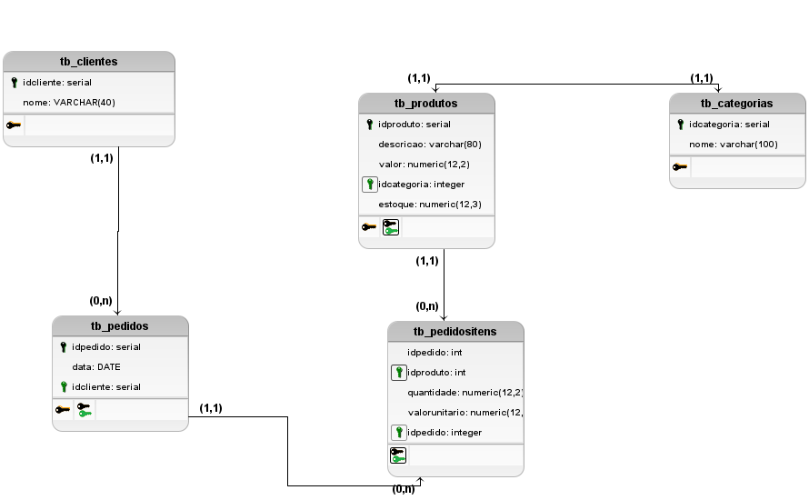

# Aprendizado de Banco de Dados - PostgreSQL

Este repositório contém materiais e exemplos do meu estudo sobre banco de dados com foco em PostgreSQL, normalização e modelagem de dados.

# Repositório de Banco de Dados e Scripts SQL

Este repositório contém scripts SQL e diagramas de modelagem para aprendizado de banco de dados, com foco no PostgreSQL, normalização e diagramas conceitual, lógico e físico.

## Estrutura de Pastas e Links
Para Modelagem foi usado o BRModelo, Todos os diagramas Diagrama Conceitual e Lógico.
A extenção do arquivo é .brM3.
```
http://www.sis4.com/brmodelo/download.html
```

### AULA 01
- [Diagrama Conceitual](AULA01/Conceitual_1.brM3)
- [Diagrama Lógico](AULA01/Lógico_1.brM3)
- [Script: Criar Banco de Dados](AULA01/Script-001-CreateDatabase.sql)
- [Script: Criar Tabela `tb_pessoas`](AULA01/Script-001-CreateTable-tb_pessoas.sql)
- [Script: Criar Tabela `livros`](AULA01/Script-002-CreateTable-livros.sql)
- [Script: Criar Tabela `Empréstimo de Livros`](AULA01/Script-010-LivroEmprestimo.sql)

### AULA 02
- [Diagrama Conceitual](AULA02/BRMODELO_Conceitual_LOESTER.brM3)
- [Diagrama Lógico](AULA02/BRMODELO_Lógico_LOESTER.brM3)
- [Script: Modelo Físico](AULA02/Scripts-001-Físico_1.sql)
- [Script: Inserts](AULA02/Scripts-002-Inserts.sql)
- [Script: Consultas](AULA02/Scripts-003-Consultas.sql)

### AULA 03
- [Diagrama Lógico](AULA03/Lógico_1.brM3)
- [Script: Criar Tabelas](AULA03/Script-001-CreateTables.sql)
- [Script: Inserts e Selects](AULA03/Script-002-InsertsAndSelects.sql)

## AULA 04 - SCHEMAS - GRANT - REVOKE
- [Script: Criar Banco de Dados](AULA04/script-01-create-database.sql)
- [Script: Criar Tabelas](AULA04/script-02-create.sql)

## AULA 05 - PROCEDURES

---

Estou aprendendo PostgreSQL, normalização de banco de dados e criação de diagramas conceitual, lógico e físico.


## Tópicos de Estudo

### 1. Banco de Dados PostgreSQL
Estou aprendendo a trabalhar com o PostgreSQL, um dos sistemas de gerenciamento de banco de dados relacionais mais poderosos e amplamente utilizados. Aqui estão alguns dos tópicos cobertos até o momento:
- Criação e manipulação de tabelas
- Consultas SQL
- Relacionamentos entre tabelas usando diferentes tipos de JOINs

#### Exemplo de JOIN:


### 2. Normalização de Banco de Dados
O processo de normalização é essencial para evitar redundância e garantir a integridade dos dados. Estou estudando as formas normais e como aplicá-las corretamente em um banco de dados.

### 3. Modelagem de Banco de Dados

#### 3.1 Diagrama Conceitual
O diagrama conceitual serve para representar as entidades e seus relacionamentos sem preocupação com detalhes de implementação. Aqui estão alguns exemplos de diagramas conceituais que desenvolvi:

- **Diagrama Conceitual 1**:
  

- **Diagrama Conceitual 2**:
  

#### 3.2 Diagrama Lógico
O diagrama lógico detalha como as entidades serão estruturadas no banco de dados relacional. Abaixo estão exemplos dos diagramas lógicos desenvolvidos durante o estudo:

- **Diagrama Lógico 1**:
  

- **Diagrama Lógico 2**:
  

- **Diagrama Lógico 3**:
  

### 4. Diagrama Físico
A modelagem física é a etapa final, onde o diagrama lógico é transformado em um banco de dados real com tabelas, colunas, chaves primárias e estrangeiras, e outros detalhes de implementação.

## Próximos Passos
- Aprofundar meu conhecimento em normalização e formas normais
- Implementar consultas mais complexas em SQL
- Modelar bancos de dados mais complexos com base nas necessidades dos projetos

---

Esse repositório será atualizado conforme eu evoluo nos estudos e aplico os conceitos aprendidos.
"# SQL-POSTGRESQL" 
